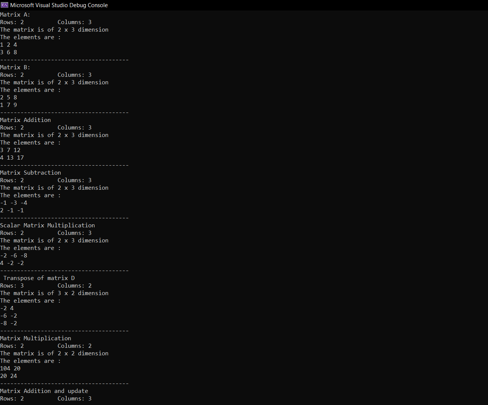
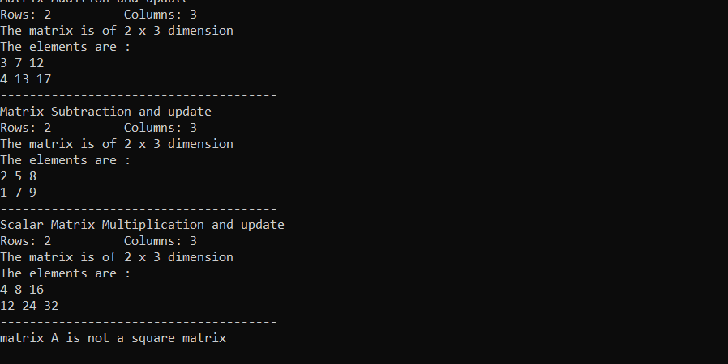

<h3>Overview</h3>

A simple <b>Matrix</b> class design that represents mathematical matrix. It provides functions for basic arithmetic operations and also some utilities like transpose, isSquareMatrix and checkDimensions.

I have overloaded the arithmetic operators and also the insertion operator for easy access of functions.

Here's a sample output of the usage of Matrix class:
 

