### The RailwayReservation code produces the Following output.

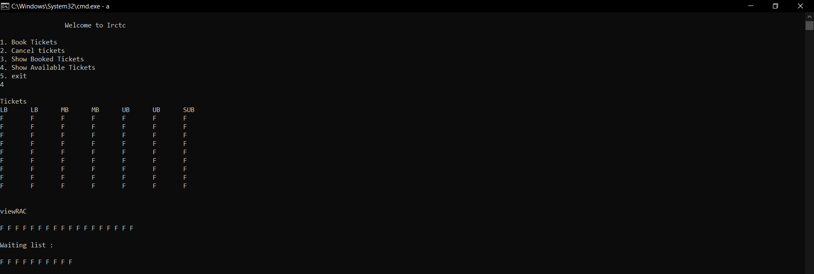
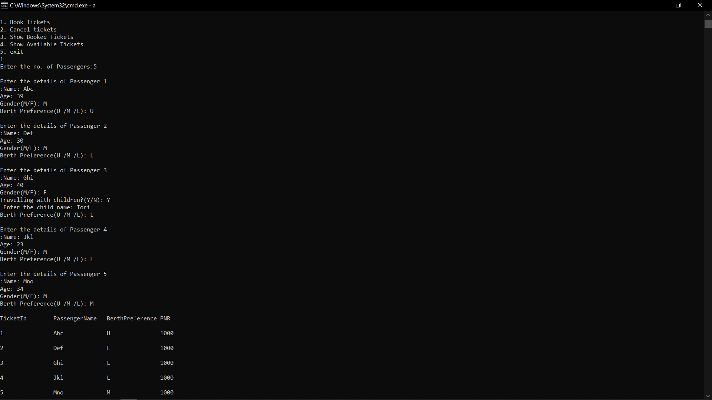
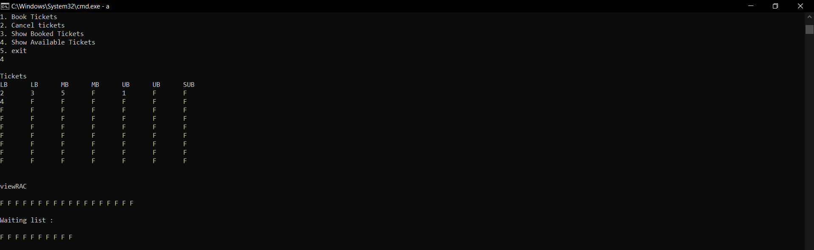
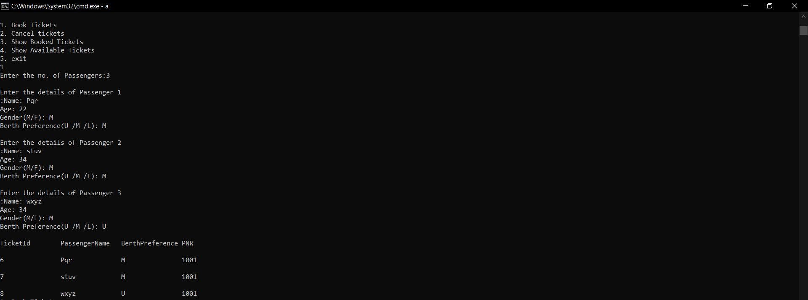

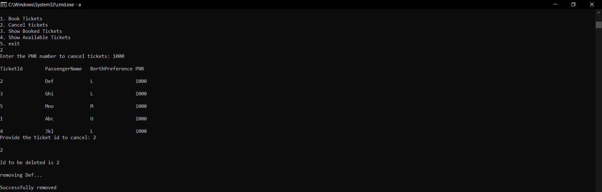

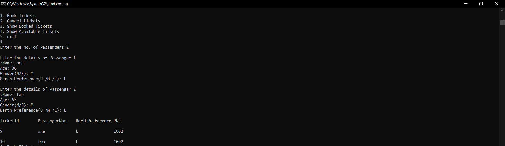
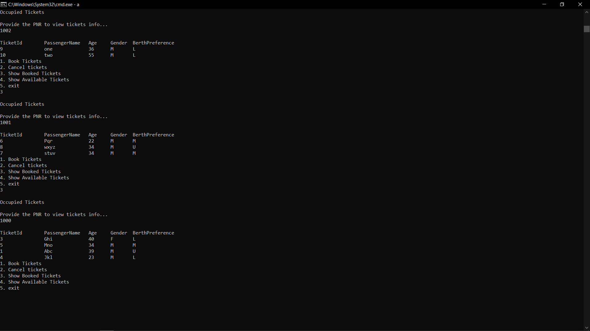

 
 

### Now, the following output are from static data which is uncommented on RailwayReservation to fill all the tickets
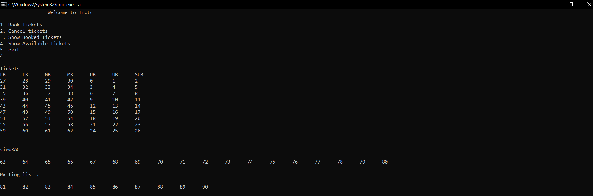
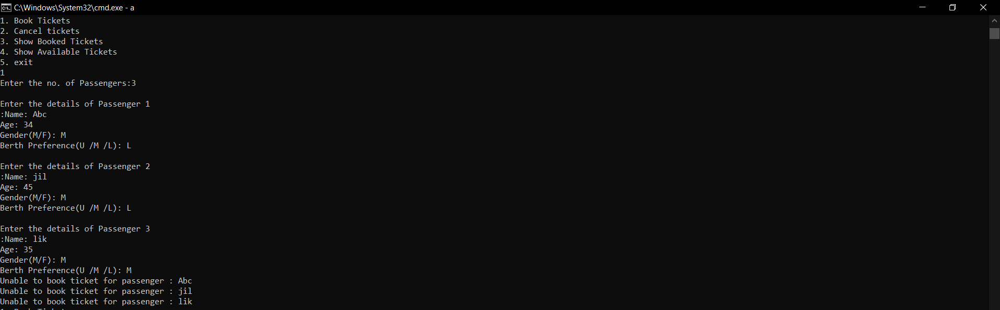
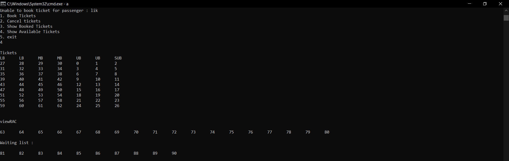
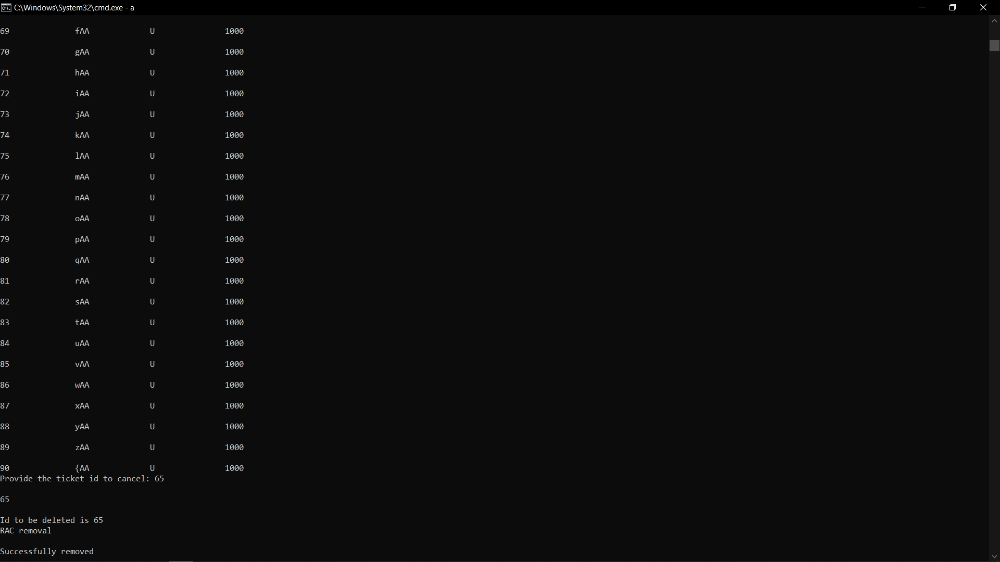
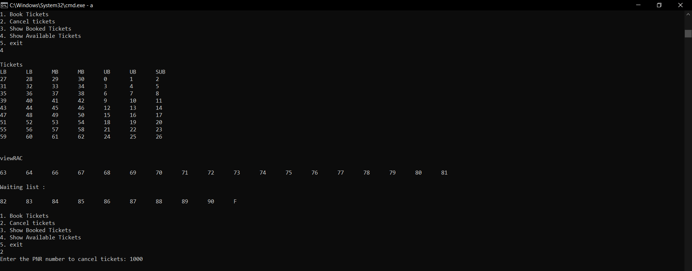

Here the ticket is removed from RAC list and produces a vacancy and therefore first ticket from waiting list moved to RAC List and hence produces a vacancy in waiting list
 

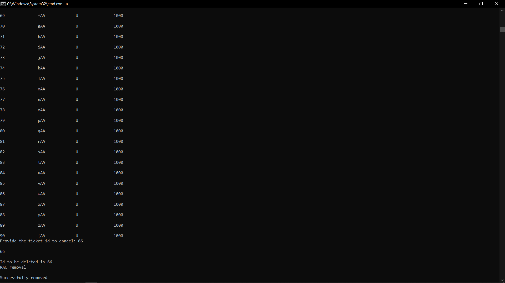
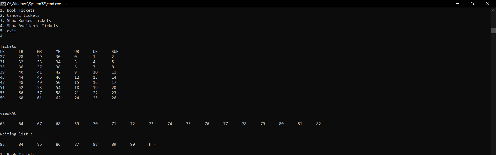

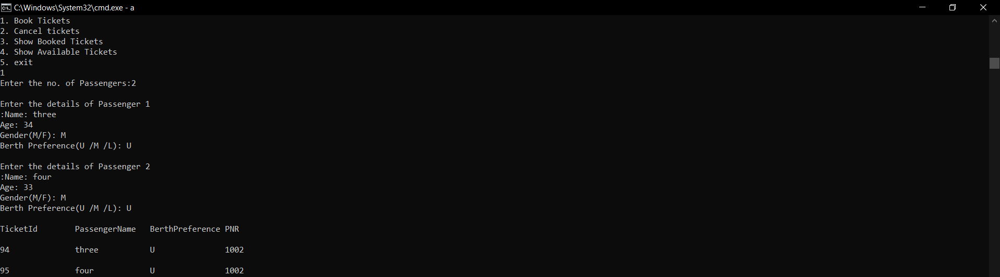
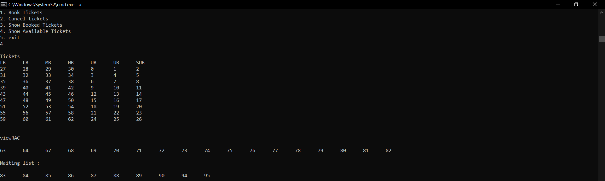
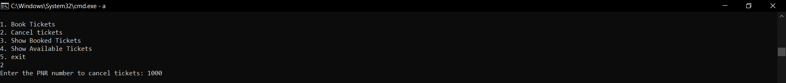
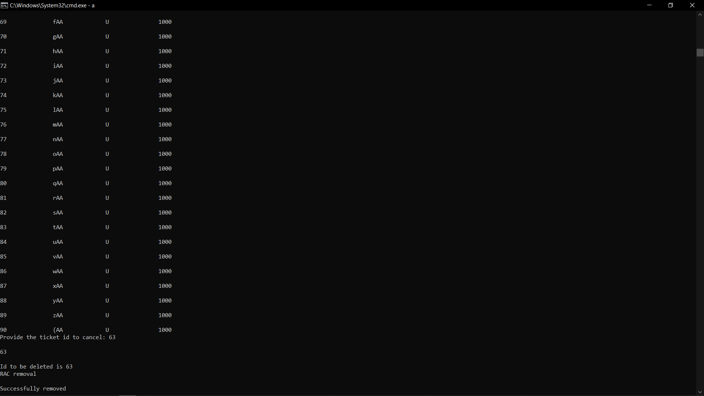
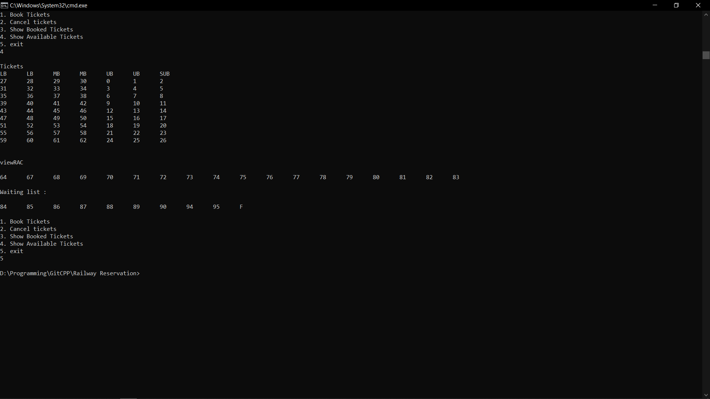

